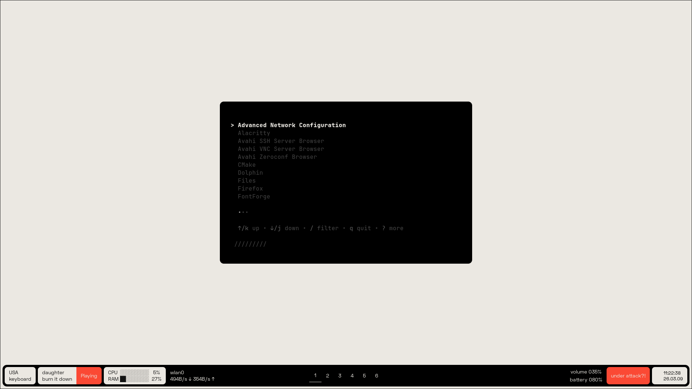

# golauncher

A minimalist application launcher TUI written in Go with Charm libraries (`bubbletea`, `bubbles`, `lipgloss`).

Built for keyboard-first Linux workflows (especially tiling WMs), `golauncher` gives you a fast searchable app menu from your terminal.



## Features
- Scans `.desktop` entries from:
  - `/usr/share/applications`
  - `/var/lib/flatpak/exports/share/applications`
- Real-time fuzzy filtering
- Detached app launching (`setsid`) so apps stay open after the launcher exits
- Single-instance lock to avoid stacked launcher windows
- Lightweight standalone binary

## Requirements
- Linux
- Go `1.25+`
- A terminal emulator

## Installation
```bash
git clone https://github.com/caiankeller/launcher.git
cd launcher
make
sudo make install
```

This installs `golauncher` to `/usr/local/bin`.

### Uninstall

```bash
sudo make uninstall
```

## Usage

Run:

```bash
golauncher
```

Available make targets:

- `make build` - build the binary
- `make install` - build and install to `/usr/local/bin`
- `make uninstall` - remove from `/usr/local/bin`
- `make clean` - remove local build artifact

Start typing to filter applications, then press `Enter` to launch.

## Hyprland example

Add this to your `hyprland.conf`:

```hypr
# Bind golauncher to Super+R
bind = SUPER, R, exec, $terminal --class "golauncher" -e golauncher

# Optional modal-like window behavior
windowrule = float, ^(golauncher)$
windowrule = center, ^(golauncher)$
windowrule = size 700 450, ^(golauncher)$
windowrule = dim_around, ^(golauncher)$
windowrule = stayfocused, ^(golauncher)$
```

## Controls
| Key | Action           |
| --- | ---              |
| `↑` / `k`              | Move selection up |
| `↓` / `j`              | Move selection down |
| `←` / `h` / `pgup`     | Previous page |
| `→` / `l` / `pgdn`     | Next page |
| `g` / `home`           | Jump to top |
| `G` / `end`            | Jump to bottom |
| `/`                    | Enter filter mode |
| `Enter`                | Launch selected app and exit |
| `Esc` / `q` / `Ctrl+C` | Quit |

## Contributing

Issues and pull requests are welcome. (pls, I beg you)

## License
MIT - see [LICENSE](LICENSE).